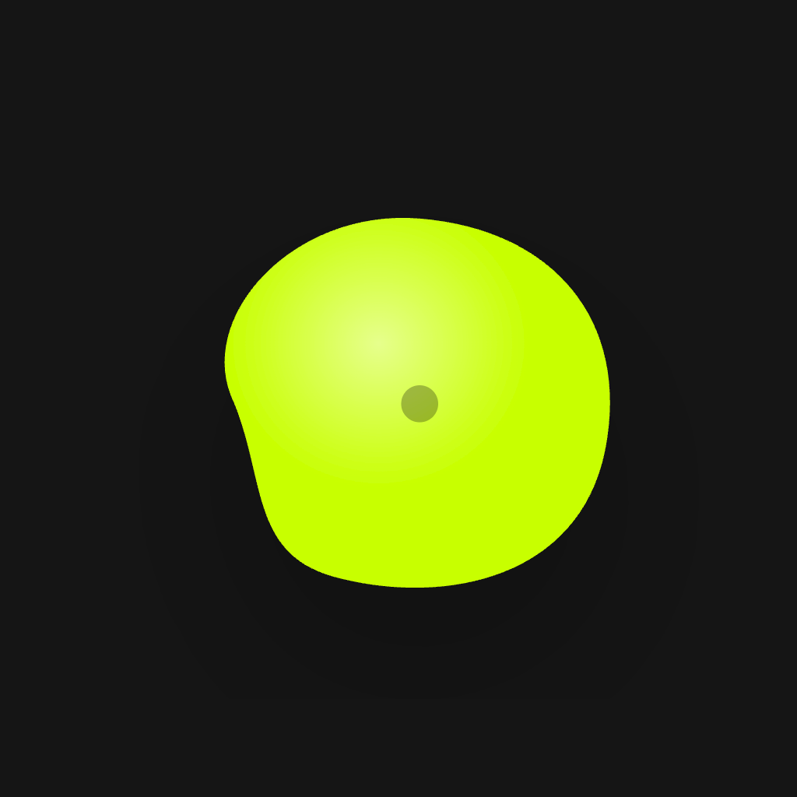
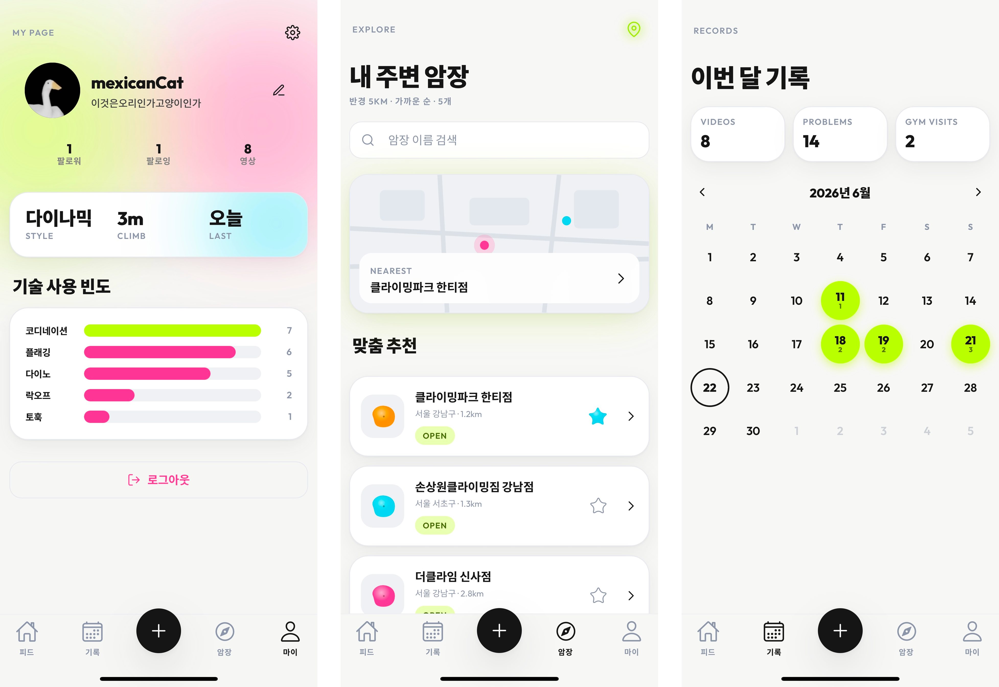
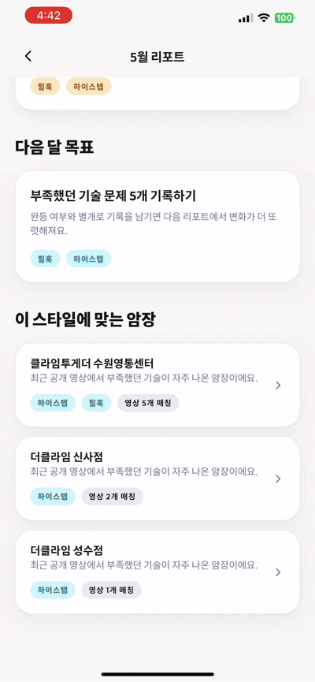
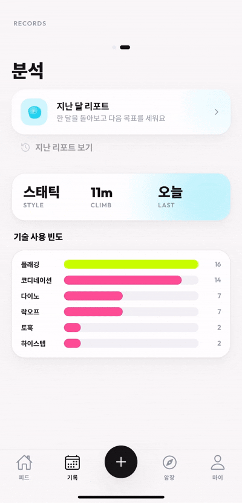
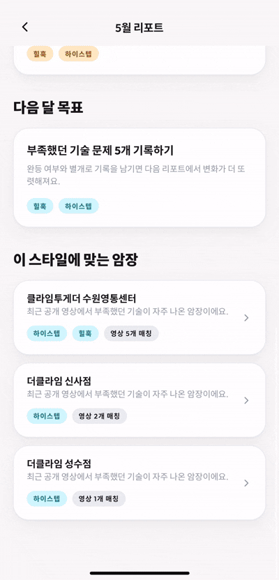
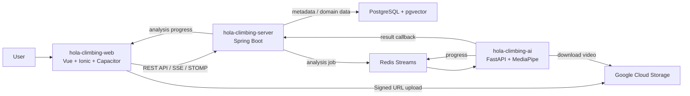
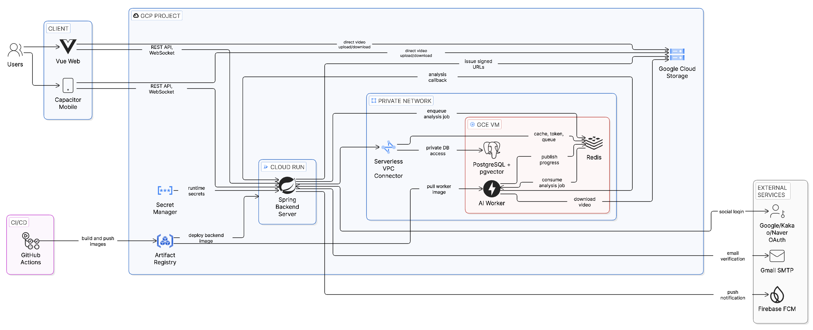
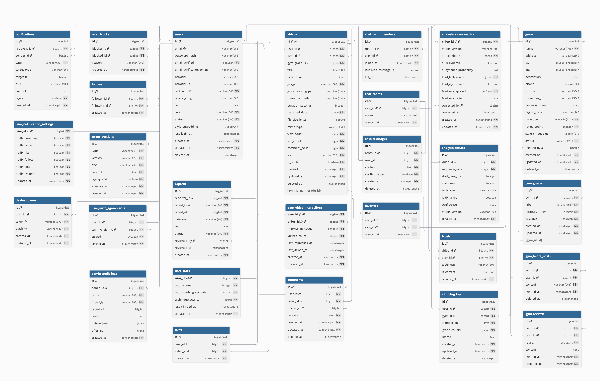

  

<h1 align="center">Hola (올라)</h1>

  <strong>AI 동작 분석으로 클라이밍 영상을 데이터화하고, 기록과 커뮤니티로 연결하는 모바일 클라이밍 영상 SNS</strong>

  <a href="https://github.com/hola-climb/hola-climbing-web">Web/App</a>
  ·
  <a href="https://github.com/hola-climb/hola-climbing-server">Backend</a>
  ·
  <a href="https://github.com/hola-climb/hola-climbing-ai">AI Worker</a>
  ·
  <a href="./docs/">Docs</a>

  

## Why Hola

클라이밍은 같은 루트라도 사람마다 무브가 다르고, 본인이 어디서 힘을 낭비하는지 스스로 보기 어렵습니다. Hola는 영상을 단순히 공유하는 데서 끝내지 않고, AI 분석 결과와 등반 기록을 함께 쌓아 개인의 성장 흐름을 볼 수 있게 만듭니다.

| Climber problem | Hola response |
|---|---|
| 내 동작과 약점을 객관적으로 보기 어렵다 | MediaPipe Pose 기반 키포인트 추출과 기술 구간 분석으로 영상 피드백을 제공합니다. |
| 기록이 영상, 사진, 메모에 흩어진다 | 영상, 분석 결과, 달력형 기록, 통계, 월간 리포트를 한 흐름으로 연결합니다. |
| 어떤 암장과 문제를 시도할지 고르기 어렵다 | 위치, 스타일 임베딩, 영상 분석 결과를 활용해 암장과 영상을 추천합니다. |
| 클라이밍 경험이 개인 기록에만 머문다 | 피드, 댓글, 좋아요, 팔로우, 암장별 채팅으로 커뮤니티 흐름을 만듭니다. |

## Product Tour

| Explore gyms | Monthly report | Gym recommendation |
|---|---|---|
|  |  |  |

## Core Loop

1. **Upload**: 클라이언트에서 영상을 선택하고 트리밍한 뒤 GCS Signed URL로 직접 업로드합니다.
2. **Analyze**: Python AI worker가 MediaPipe Pose로 33개 키포인트를 추출하고 클라이밍 기술 구간을 라벨링합니다.
3. **Reflect**: 사용자는 분석 결과, 기술별 통계, 달력 기록, 월간 리포트로 자신의 등반 패턴을 확인합니다.
4. **Discover**: 위치, 스타일 임베딩, 영상 분석 결과를 바탕으로 암장과 영상을 추천받습니다.
5. **Connect**: 피드, 댓글, 좋아요, 팔로우, 암장별 채팅으로 다른 클라이머와 연결됩니다.

## Architecture

Hola는 모바일 클라이언트, Spring API 서버, Python AI worker, Redis, PostgreSQL/pgvector, GCS를 분리한 비동기 분석 구조로 동작합니다.

Full GCP architecture diagram

## Repositories

| Repository | Responsibility | Stack |
|---|---|---|
| [`hola-climbing-web`](https://github.com/hola-climb/hola-climbing-web) | 모바일 중심 클라이언트: 피드, 영상 업로드/트리밍, 기록, 암장 탐색, OAuth callback, 알림, 관리자 UI | Vue 3, Vite, TypeScript, Ionic Vue, Capacitor 8, Pinia, FFmpeg, Firebase |
| [`hola-climbing-server`](https://github.com/hola-climb/hola-climbing-server) | API 서버: 인증, 영상, 암장, 통계, 추천, 채팅, 알림, 신고/관리자, AI 분석 dispatch/result 저장 | Java 25, Spring Boot 4, MyBatis, PostgreSQL/pgvector, Redis, GCS, WebSocket STOMP |
| [`hola-climbing-ai`](https://github.com/hola-climb/hola-climbing-ai) | 분석 worker: GCS 영상 다운로드, 포즈 추출, 기술 구간 분석, 진행률 publish, Spring callback | Python 3.11, FastAPI, MediaPipe, OpenCV, Redis Streams, GCS |

## Engineering Highlights

- **Server-bypass video upload**: 대용량 영상 파일은 서버를 경유하지 않고 GCS v4 Signed URL로 직접 업로드합니다.
- **Async AI pipeline**: Spring 서버가 Redis Streams에 분석 작업을 등록하고, Python worker가 소비해 결과를 callback합니다.
- **Realtime where it fits**: 분석 진행률은 Redis Pub/Sub + SSE로 전달하고, 암장 채팅은 WebSocket STOMP로 처리합니다.
- **Vector recommendation**: PostgreSQL/pgvector를 사용해 개인화 영상 피드와 암장 추천 경로를 구성합니다.
- **Product-safe AI report**: 월간 리포트 문장은 OpenAI `gpt-4.1-mini` JSON mode를 사용할 수 있고, 실패 시 rule-based fallback으로 대체됩니다.
- **Operational hardening**: Flyway migration, Testcontainers integration test, actuator health check, Cloud Run backend, VM-hosted AI/Redis/PostgreSQL 운영 경로를 정리했습니다.
- **Regression evidence**: `hola-climbing-server` full test suite는 2026-07-02 기준 `./mvnw test` 397 tests passing으로 기록되어 있습니다.

## Product Surface

| Area | Features |
|---|---|
| SNS | 이메일/OAuth 로그인, 프로필, 팔로우, 차단, 피드, 댓글, 좋아요 |
| Climbing video | 업로드, 트리밍, 영상 상세, 분석 상태, 분석 결과, 피드백 |
| Records | 클라이밍 로그, 달력 기록, 기술 통계, 월간 리포트 |
| Gyms | 근처 암장, 검색, 상세, 리뷰, 즐겨찾기, 암장별 영상 |
| Recommendation | 개인화 영상 피드, 근처/스타일 기반 암장 추천, 영상 기반 암장 추천 |
| Realtime/Ops | SSE 분석 진행률, STOMP 암장 채팅, FCM 알림, 신고, 관리자 대시보드 |

## Data Model

백엔드 데이터 모델은 사용자 신원, 소셜 그래프, 영상, AI 분석 결과, 암장, 클라이밍 로그, 추천, 알림, 리포트, 채팅, 관리자 감사 로그를 포함합니다.

ERD

## Documentation & Artifacts

| Artifact | What it shows |
|---|---|
| [Final report](./docs/final-report.md) | 제품 목표, 요구사항, 아키텍처, AI pipeline, QA, troubleshooting |
| [API spec](./docs/api-spec.md) | REST API catalogue, common response format, auth rules, error catalogue |
| [Screen designs](./docs/screen-designs/) | 홈 피드, 영상 업로드, 분석 결과, 기록, 암장 탐색, 마이페이지 등 22개 화면 |
| [Design system](./docs/design-system.md) | visual identity, color, type, cards, motion, mobile UI kit |
| [External API notes](./docs/external-apis.md) | GCS, OAuth, Kakao Maps, SMTP, FCM, OpenAI, Geolocation |
| [Generative AI notes](./docs/generative-ai.md) | 월간 리포트 LLM mode, JSON output, safety prompt, rule-based fallback |

## Project Status

Hola는 SSAFY 자율 프로젝트로 2026-05-15부터 2026-06-25까지 개발되었고, 발표 이후에는 개인 고도화와 운영 안정화 중심으로 정리 중입니다.

| Member | Focus |
|---|---|
| 김민준 | Backend, AI pipeline integration, deployment and operations hardening |
| 곽예경 | Frontend, mobile app UX, AI pipeline collaboration |

This README intentionally avoids public traffic, user-count, revenue, QPS, and model-accuracy claims unless source evidence is attached.
